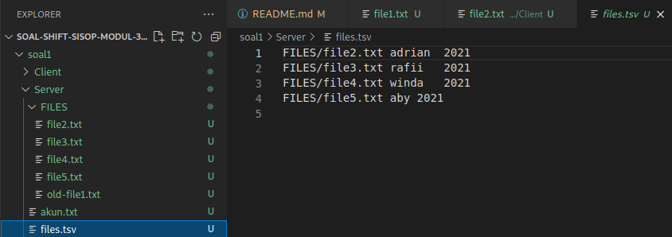

# soal-shift-sisop-modul-3-IT13-2021

### <b> Nama Anggota Kelompok: </b>
#### 1. Asiyah Hanifah (05311940000002)
#### 2. Muhammad Yasykur Rafii (05311940000017)
#### 3. Christopher Adrian Kusuma (05311940000022)
---

## Soal 1

Keverk adalah orang yang cukup ambisius dan terkenal di angkatannya. Sebelum dia menjadi ketua departemen di HMTC, dia pernah mengerjakan suatu proyek dimana keverk tersebut meminta untuk membuat server database buku. Proyek ini diminta agar dapat digunakan oleh pemilik aplikasi dan diharapkan bantuannya dari pengguna aplikasi ini.</br>
</br>
Di dalam proyek itu, Keverk diminta: </br>

(a) Pada saat client tersambung dengan server, terdapat dua pilihan pertama, yaitu register dan login. Jika memilih register, client akan diminta input id dan passwordnya untuk dikirimkan ke server. User juga dapat melakukan login. Login berhasil jika id dan password yang dikirim dari aplikasi client sesuai dengan list akun yang ada didalam aplikasi server. Sistem ini juga dapat menerima multi-connections. Koneksi terhitung ketika aplikasi client tersambung dengan server. Jika terdapat 2 koneksi atau lebih maka harus menunggu sampai client pertama keluar untuk bisa melakukan login dan mengakses aplikasinya. Keverk menginginkan lokasi penyimpanan id dan password pada file bernama akun.txt dengan format :

<b>akun.txt</b></br>
> id:password </br>
> id2:password2

</br>
(b) Sistem memiliki sebuah database yang bernama files.tsv. Isi dari files.tsv ini adalah path file saat berada di server, publisher, dan tahun publikasi. Setiap penambahan dan penghapusan file pada folder file yang bernama  FILES pada server akan memengaruhi isi dari files.tsv. Folder FILES otomatis dibuat saat server dijalankan. 
</br>
(c) Tidak hanya itu, Keverk juga diminta membuat fitur agar client dapat menambah file baru ke dalam server. Direktori FILES memiliki struktur direktori di bawah ini :

Direktori <b>FILES</b>
> File1.ekstensi </br>
> File2.ekstensi

Pertama client mengirimkan input ke server dengan struktur sebagai berikut :</br>
Contoh Command Client :
> add

Output Client Console:
     
> Publisher: </br>
> Tahun Publikasi:</br>
> Filepath:

Kemudian, dari aplikasi client akan dimasukan data buku tersebut (perlu diingat bahwa Filepath ini merupakan path file yang akan dikirim ke server). Lalu client nanti akan melakukan pengiriman file ke aplikasi server dengan menggunakan socket. Ketika file diterima di server, maka row dari files.tsv akan bertambah sesuai dengan data terbaru yang ditambahkan.

</br>
(d) Dan client dapat mendownload file yang telah ada dalam folder FILES di server, sehingga sistem harus dapat mengirim file ke client. Server harus melihat dari files.tsv untuk melakukan pengecekan apakah file tersebut valid. Jika tidak valid, maka mengirimkan pesan error balik ke client. Jika berhasil, file akan dikirim dan akan diterima ke client di folder client tersebut. 

Contoh Command client
> download TEMPfile.pdf

</br>
(e) Setelah itu, client juga dapat menghapus file yang tersimpan di server. Akan tetapi, Keverk takut file yang dibuang adalah file yang penting, maka file hanya akan diganti namanya menjadi ‘old-NamaFile.ekstensi’. Ketika file telah diubah namanya, maka row dari file tersebut di file.tsv akan terhapus.

Contoh Command Client:

> delete TEMPfile.pdf

</br>
(f) Client dapat melihat semua isi files.tsv dengan memanggil suatu perintah yang bernama see. Output dari perintah tersebut keluar dengan format. 

Contoh Command Client :
>see

Contoh Format Output pada Client:
> Nama:<br>
Publisher: <br>
Tahun publishing:<br>
Ekstensi File : <br>
Filepath : <br>

>Nama: <br>
Publisher: <br>
Tahun publishing: <br>
Ekstensi File : <br>
Filepath : <br>

</br>
(g) Aplikasi client juga dapat melakukan pencarian dengan memberikan suatu string. Hasilnya adalah semua nama file yang mengandung string tersebut. Format output seperti format output f.

Contoh Client Command:
> find TEMP

</br>
(h) Dikarenakan Keverk waspada dengan pertambahan dan penghapusan file di server, maka Keverk membuat suatu log untuk server yang bernama running.log. Contoh isi dari log ini adalah

<b>running.log</b></br>
>Tambah : File1.ektensi (id:pass)</br>
Hapus : File2.ektensi (id:pass)

Akan tetapi, kevek saat itu masih belum paham dengan sistem server dan client.

Bantulah Keverk untuk menyelesaikan proyek ini!
### <b>Note:</b>
- Dilarang menggunakan system() dan execv(). Silahkan dikerjakan sepenuhnya dengan thread dan socket programming. 
- Untuk download dan upload silahkan menggunakan file teks dengan ekstensi dan isi bebas (yang ada isinya bukan touch saja dan tidak kosong) dan requirement untuk benar adalah percobaan dengan minimum 5 data.

Struktur Direktori:
> ├── Client</br>
│ ... ├── client.c</br>
│ ... ├── File2.extensi</br>
│ ... └── File1.extensi</br>
└── Server</br>
  ...... ├── akun.txt</br>
  ...... ├── files.tsv</br>
  ...... ├── server.c</br>
......  ├── running.log</br>
......     └── FILES</br>
     ..............       ├── File2.extensi</br>
    ..............       └── File1.ekstensi</br>

## Penyelesaian:
### Code:
<b> server.c </b></br>
```c
#include <stdio.h>
#include <sys/socket.h>
#include <sys/stat.h>
#include <stdlib.h>
#include <netinet/in.h>
#include <string.h>
#include <unistd.h>
#include <dirent.h>
#include <ctype.h>
#include <math.h>

#define PORT 8080
#define SO_REUSEPORT 15

int n;

//membuat struct untuk user yang terdiri dari id (nama) dan password (pwd)
struct user {
    char name[50];
    char pwd[50];
};
 
 // membuat struct untuk file yang akan dibuat
struct file {
    char name[50];
    char path[50];
    char publisher[50];
    char ext[20];
    char year[5];
};

char *file_ext(char *file) {
    char *p = strchr(file, '.');
    if (p == NULL) return "exe";
    if (p - file == 6) {
        p = strchr(p+1, '.');
    }

    char *ext;
    ext = (char *)malloc(sizeof(char*) * 50);
    sprintf(ext, "%.*s", strlen(file) - (p - file + 1), p + 1);
    for (size_t i = 0; i < strlen(ext); ++i) {
        *(ext + i) = tolower(*(ext + i));
    }
    return ext;
}

char *see(struct file files[], int n) {
    char *buf;
    buf = (char *)malloc(sizeof(char) * 1024);
    memset(buf, 0, sizeof(buf));

    /*
        Nama: 
        Publisher:
        Tahun publishing:
        Ekstensi File : 
        Filepath : 
    */

    for (int i = 0; i < n; ++i) {
        sprintf(files[i].ext, "%s", file_ext(files[i].path));
        char *p = strstr(files[i].path, files[i].ext);
        if (p == NULL) {
            sprintf(files[i].name, "%.*s", strlen(files[i].path) - 6, files[i].path + 6);
        } else {
            sprintf(files[i].name, "%.*s", strlen(files[i].path) - 6, files[i].path + 6);
        }

        sprintf(buf, "%s\nNama: %s\nPublisher: %s\nTahun publishing: %s\nEkstensi File: %s\nFilepath: %s\n", buf, files[i].name, files[i].publisher, files[i].year, files[i].ext, files[i].path);
    }

    return buf;
}

int find_user(char *name, char *pwd) {
    // printf("%s:%s %d:%d\n", name, pwd, strlen(name), strlen(pwd));
    int n = 0, mode = 0;

    struct user users[50];

    for (int i = 0; i < 50; ++i) {
        memset(users[i].name, 0, sizeof(users[i].name));
        memset(users[i].pwd, 0, sizeof(users[i].pwd));
    }

    FILE *fptr;
    fptr = fopen("akun.txt", "r");

    fseek(fptr, 0, SEEK_END);
    long fsize = ftell(fptr);
    rewind(fptr);

    char *str = (char *)malloc(sizeof(char) * (fsize + 1));
    fread(str, 1, fsize, fptr);

    for (int i = 0; i <= fsize; ++i) {
        if (str[i] == ':') {
            mode ^= 1;
            continue;
        }
        if (str[i] == '\n' || str[i] == ' ') {
            mode ^= 1;
            ++n;
            continue;
        }

        if (mode == 0) {
            sprintf(users[n].name, "%s%c", users[n].name, str[i]);
        } else {
            sprintf(users[n].pwd, "%s%c", users[n].pwd, str[i]);
        }
    }

    fclose(fptr);

    for (int i = 0; i < n; ++i) {
        // printf("%s:%s %d:%d\n", users[i].name, users[i].pwd, strlen(users[i].name), strlen(users[i].pwd));
        if (strcmp(users[i].name, name) == 0 && strcmp(users[i].pwd, pwd) == 0) {
            return 1;
        }
    }
    
    return 0;
}

// fungsi untuk register untuk mendaftarkan id dan password
void reg(char *name, char *pwd) {
    FILE *fptr;
    // di sini dia akan membuat akun.txt
    fptr = fopen("akun.txt", "a");

    // kemudian dalam file akun.txt akan ditulis atau diprint name (id) dan password (pwd)
    fprintf(fptr, "%s:%s\n", name, pwd);
    
    fclose(fptr);
}

//membuat struct file
struct file *parse_files() {
    n = 0;
    int mode = 0;

    struct file *files;
    files = (struct file *)malloc(sizeof(struct file) * 50);

    for (int i = 0; i < 5; ++i) {
        memset(files[i].ext, 0, sizeof(files[i].ext));
        memset(files[i].name, 0, sizeof(files[i].name));
        memset(files[i].path, 0, sizeof(files[i].path));
        memset(files[i].publisher, 0, sizeof(files[i].publisher));
        memset(files[i].year, 0, sizeof(files[i].year));
    }

    FILE *fptr;
    fptr = fopen("files.tsv", "r");

    fseek(fptr, 0, SEEK_END);
    long fsize = ftell(fptr);
    rewind(fptr);

    char *str = (char *)malloc(sizeof(char) * (fsize + 1));
    fread(str, 1, fsize, fptr);

    for (int i = 0; i <= fsize; ++i) {
        if (str[i] == '\t') {
            mode += 1;
            continue;
        }
        if (str[i] == '\n') {
            mode = 0;
            ++n;
            continue;
        }

        if (mode == 0) {
            sprintf(files[n].path, "%s%c", files[n].path, str[i]);
        } else if (mode == 1) {
            sprintf(files[n].publisher, "%s%c", files[n].publisher, str[i]);
        } else {
            sprintf(files[n].year, "%s%c", files[n].year, str[i]);
        }
    }

    for (int i = 0; i < n; ++i) {
        sprintf(files[i].ext, "%s", file_ext(files[i].path));
        char *p = strstr(files[i].path, files[i].ext);
        if (p == NULL) {
            sprintf(files[i].name, "%.*s", strlen(files[i].path) - 6, files[i].path + 6);
        } else {
            sprintf(files[i].name, "%.*s", strlen(files[i].path) - 6, files[i].path + 6);
        }
    }

    fclose(fptr);

    return files;
}

//membuat fungsi delete untuk menghapus file yang diinginkan
void delete(char *file) {
    struct file *files = parse_files();
    struct file *new_files = (struct file *)malloc(sizeof(struct file) * 50);
    int j = 0;
    for (int i = 0; i < n; ++i) {
        if (strcmp(files[i].name, file) == 0) {
            continue;
        }

        sprintf(new_files[j].ext, "%s", files[i].ext);
        sprintf(new_files[j].name, "%s", files[i].name);
        sprintf(new_files[j].path, "%s", files[i].path);
        sprintf(new_files[j].publisher, "%s", files[i].publisher);
        sprintf(new_files[j].year, "%s", files[i].year);

        ++j;
    }

    if (j == n) return;

    
    char old_name[50];
    sprintf(old_name, "FILES/%s", file);

    //deklarasi variable old_name untuk menamai file yang sudah dihapus
    char new_name[50];
    sprintf(new_name, "FILES/old-%s", file);

    if (rename(old_name, new_name) < 0) {
        printf("error renaming %s to %s\n", old_name, new_name);
    }

    FILE *fptr;
    fptr = fopen("files.tsv", "w");

    for (int i = 0; i < j; ++i) {
        fprintf(fptr, "%s\t%s\t%s\n", new_files[i].path, new_files[i].publisher, new_files[i].year);
        // printf("%s\t%s\t%s\n", new_files[i].path, new_files[i].publisher, new_files[i].year);
    }

    fclose(fptr);
}

int main(int argc, char const *argv[]) {
    int server_fd, new_socket;
    struct sockaddr_in address;
    int opt = 1;
    int addrlen = sizeof(address);

    // msg for client
    char *login_or_register = "login/register: ";
    char *id = "id: ";
    char *pwd = "password: ";
    char *login_success = "login success";
    char *login_fail = "login failed";
    char *register_success = "register success";
    char *file_pattern_not_found = "file pattern doesn't match";

    // msg from client
    char buffer[1024] = {0};
    char user_id[1024];
    char user_pwd[1024];
      
    if ((server_fd = socket(AF_INET, SOCK_STREAM, 0)) == 0) {
        perror("socket failed");
        exit(EXIT_FAILURE);
    }
      
    if (setsockopt(server_fd, SOL_SOCKET, SO_REUSEADDR | SO_REUSEPORT, &opt, sizeof(opt))) {
        perror("setsockopt");
        exit(EXIT_FAILURE);
    }

    address.sin_family = AF_INET;
    address.sin_addr.s_addr = INADDR_ANY;
    address.sin_port = htons( PORT );
      
    if (bind(server_fd, (struct sockaddr *)&address, sizeof(address))<0) {
        perror("bind failed");
        exit(EXIT_FAILURE);
    }

    if (listen(server_fd, 3) < 0) {
        perror("listen");
        exit(EXIT_FAILURE);
    }

    mkdir("FILES", 0755);

    while (1) {
        if ((new_socket = accept(server_fd, (struct sockaddr *)&address, (socklen_t*)&addrlen))<0) {
            perror("accept");
            exit(EXIT_FAILURE);
        }

        // code here
        while (1) {
            send(new_socket, login_or_register, strlen(login_or_register), 0);
            read(new_socket, buffer, 1024);
            printf("user %s\n", buffer);

            memset(user_id, 0, sizeof(user_id));
            memset(user_pwd, 0, sizeof(user_pwd));

            if (strcmp(buffer, "register") == 0) {
                // id
                send(new_socket, id, strlen(id), 0);
                read(new_socket, user_id, 1024);
                printf("id: %s\n", user_id);
                
                // pwd
                send(new_socket, pwd, strlen(pwd), 0);
                read(new_socket, user_pwd, 1024);
                printf("password: %s\n", user_pwd);

                reg(user_id, user_pwd);
                send(new_socket, register_success, strlen(register_success), 0);
            } else if (strcmp(buffer, "login") == 0) {
                // id
                send(new_socket, id, strlen(id), 0);
                read(new_socket, user_id, 1024);
                printf("id: %s\n", user_id);
                
                // pwd
                send(new_socket, pwd, strlen(pwd), 0);
                read(new_socket, user_pwd, 1024);
                printf("password: %s\n", user_pwd);

                if (find_user(user_id, user_pwd)) {
                    send(new_socket, login_success, strlen(login_success), 0);
                    printf("%s\n", login_success);
                    break;
                } else {
                    send(new_socket, login_fail, strlen(login_fail), 0);
                    printf("%s\n", login_fail);
                }
            }

            memset(buffer, 0, sizeof(buffer));
            sleep(2);
        }
        printf("\n");

        while (1) {
            memset(buffer, 0, sizeof(buffer));
            read(new_socket, buffer, 1024);

            if (strncmp(buffer, "add", 3) == 0) {
                printf("user add\n");
                char publisher[1024];
                char year[1024];
                char path[1024];
                char filepath[1024];

                read(new_socket, publisher, 1024);
                printf("Publisher: %s\n", publisher);

                read(new_socket, year, 1024);
                printf("Tahun Publikasi: %s\n", year);

                read(new_socket, path, 1024);
                printf("Filepath: %s\n", path);


                sprintf(filepath, "FILES/%s", path);
                // printf("%s\n", filepath);

                // tsv
                FILE *fptr;

                fptr = fopen("files.tsv", "a");
                fprintf(fptr, "%s\t%s\t%s\n", filepath, publisher, year);
                fclose(fptr);

                // log
                fptr = fopen("running.log", "a");
                fprintf(fptr, "Tambah : %s (%s:%s)\n", filepath, user_id, user_pwd);
                fclose(fptr);

                // receive file
                char file_content[65535];
                char file_length[1024];
                unsigned long fsize;

                memset(file_content, 0, sizeof(file_content));
                memset(file_length, 0, sizeof(file_length));

                // receive file size
                read(new_socket, file_length, 1024);
                fsize = strtol(file_length, NULL, 0);

                // receive file content
                for (long i = 0; i < fsize; i += 1024) {
                    memset(buffer, 0, sizeof(buffer));
                    read(new_socket, buffer, 1024);
                    strcat(file_content, buffer);
                }

                // printf("%s\n", file_content);

                fptr = fopen(filepath, "w");
                fprintf(fptr, "%s", file_content);
                fclose(fptr);
            } else if (strncmp(buffer, "download", 8) == 0) {
                printf("user download\n");

                char file_to_download[50];
                sprintf(file_to_download, "%.*s", strlen(buffer) - 9, buffer + 9);

                // file status
                char *file_exist = "found";
                char *file_not_exist = "not found";

                // find file
                int found = 0;
                struct file *files = parse_files();
                for (int i = 0; i < n; ++i) {
                    if (strcmp(files[i].name, file_to_download) == 0) {
                        found = 1;
                        break;
                    }
                }

                if (found) {
                    send(new_socket, file_exist, sizeof(file_exist), 0);
                } else {
                    send(new_socket, file_not_exist, sizeof(file_not_exist), 0);
                    continue;
                }

                sleep(1);
                // send file
                char file_length[1024];
                char *file_content = (char *)malloc(sizeof(char) * 65536);
                char file_to_open[1024];

                memset(file_length, 0, sizeof(file_length));
                memset(file_to_open, 0, sizeof(file_to_open));
                
                sprintf(file_to_open, "FILES/%s", file_to_download);

                FILE *fptr;
                fptr = fopen(file_to_open, "r");

                fseek(fptr, 0, SEEK_END);
                long fsize = ftell(fptr);
                rewind(fptr);

                fread(file_content, 1, fsize, fptr);

                fclose(fptr);

                // send file size
                sprintf(file_length, "%ld", fsize);
                send(new_socket, file_length, sizeof(file_length), 0);
                sleep(1);

                // send file content
                for (long i = 0; i < fsize; i += 1024) {
                    memset(buffer, 0, sizeof(buffer));
                    sprintf(buffer, "%.*s", fsize < 1024 ? fsize : abs(fsize - i) < 1024 ? abs(fsize - 1) : 1024, file_content + i);
                    send(new_socket, buffer, sizeof(buffer), 0);
                }

            } else if (strncmp(buffer, "delete", 6) == 0) {
                printf("user delete\n");

                char file_to_delete[50];
                sprintf(file_to_delete, "%.*s", strlen(buffer) - 7, buffer + 7);
                delete(file_to_delete);

                FILE *fptr;
                fptr = fopen("running.log", "a");

                fprintf(fptr, "Hapus : %s (%s:%s)\n", file_to_delete, user_id, user_pwd);

                fclose(fptr);

                memset(file_to_delete, 0, sizeof(file_to_delete));
            } else if (strncmp(buffer, "see", 3) == 0) {
                printf("user see\n");

                struct file *files = parse_files();
                char *files_tsv = (char *)malloc(sizeof(char) * 1024);

                sprintf(files_tsv, "%s", see(files, n));
                send(new_socket, files_tsv, strlen(files_tsv), 0);
            } else if (strncmp(buffer, "find", 4) == 0) {
                printf("user find\n");

                char file_to_find[50];
                sprintf(file_to_find, "%.*s", strlen(buffer) - 5, buffer + 5);

                char *buf = (char *)malloc(sizeof(char) * 1024);
                memset(buf, 0, sizeof(buf));

                struct file *files = parse_files();
                for (int i = 0; i < n; ++i) {
                    char *p;
                    p = strstr(files[i].name, file_to_find);
                    if (p) {
                        sprintf(buf, "%s\nNama: %s\nPublisher: %s\nTahun publishing: %s\nEkstensi File: %s\nFilepath: %s\n", buf, files[i].name, files[i].publisher, files[i].year, files[i].ext, files[i].path);
                    }
                }

                if (strlen(buf) == 0) {
                    send(new_socket, file_pattern_not_found, strlen(file_pattern_not_found), 0);
                } else {
                    send(new_socket, buf, strlen(buf), 0);
                }
            } else {
                break;
            }
            printf("\n");
        }

        close(new_socket);
    }

    return 0;
}
```
<b>client.c</b></br>
```c
#include <stdio.h>
#include <sys/socket.h>
#include <stdlib.h>
#include <netinet/in.h>
#include <string.h>
#include <unistd.h>
#include <arpa/inet.h>
#include <math.h>

#define PORT 8080

int main(int argc, char const *argv[]) {
    struct sockaddr_in address;
    int sock = 0;
    struct sockaddr_in serv_addr;

    // msg for server
    char input[1024];

    // msg from server
    char buffer[1024] = {0};

    if ((sock = socket(AF_INET, SOCK_STREAM, 0)) < 0) {
        printf("\n Socket creation error \n");
        return -1;
    }
  
    memset(&serv_addr, '0', sizeof(serv_addr));
  
    serv_addr.sin_family = AF_INET;
    serv_addr.sin_port = htons(PORT);
      
    if (inet_pton(AF_INET, "127.0.0.1", &serv_addr.sin_addr) <= 0) {
        printf("\nInvalid address/ Address not supported \n");
        return -1;
    }
    
    // jika tidak terconnect dengan server manapun
    if (connect(sock, (struct sockaddr *)&serv_addr, sizeof(serv_addr)) < 0) {
        //menampilkan Connection Failed
        printf("\nConnection Failed \n");
        return -1;
    }


    // code here

    // login/register
    do {
        memset(buffer, 0, sizeof(buffer));
        read(sock, buffer, sizeof(buffer));
        printf("login/register: ");
        scanf("%s", input);
        send(sock, input, strlen(input), 0);
        memset(input, 0, sizeof(input));

        // id
        memset(buffer, 0, sizeof(buffer));
        read(sock, buffer, sizeof(buffer));
        printf("id: ");
        scanf("%s", input);
        send(sock, input, strlen(input), 0);
        memset(input, 0, sizeof(input));

        // pwd
        memset(buffer, 0, sizeof(buffer));
        read(sock, buffer, sizeof(buffer));
        printf("password: ");
        scanf("%s", input);
        send(sock, input, strlen(input), 0);
        memset(input, 0, sizeof(input));

        // success or fail
        read(sock, buffer, 1024);
        printf("%s\n", buffer);
    } while (strcmp(buffer, "login success") != 0);

    printf("\n");

    // jika akun sudah logged in
    while (1) {
        memset(buffer, 0, sizeof(buffer));
        
        //user dapat memasukkan command
        printf("command: ");
        scanf("\n");
        scanf("%[^\n]%*c", input);
        if (strncmp(input, "add", 3) == 0) {
            send(sock, input, sizeof(input), 0);
            
            // publisher
            memset(input, 0, sizeof(input));
            printf("Publisher: ");
            scanf("%s", input);
            send(sock, input, sizeof(input), 0);

            // year
            memset(input, 0, sizeof(input));
            printf("Tahun publikasi: ");
            scanf("%s", input);
            send(sock, input, sizeof(input), 0);

            // filepath
            memset(input, 0, sizeof(input));
            printf("Filepath: ");
            scanf("%s", input);
            send(sock, input, sizeof(input), 0);

            // send file
            char file_length[1024];
            char *file_content = (char *)malloc(sizeof(char) * 65536);

            memset(file_length, 0, sizeof(file_length));

            FILE *fptr;
            fptr = fopen(input, "r");

            fseek(fptr, 0, SEEK_END);
            long fsize = ftell(fptr);
            rewind(fptr);

            fread(file_content, 1, fsize, fptr);

            fclose(fptr);

            // send file size
            sprintf(file_length, "%ld", fsize);
            send(sock, file_length, sizeof(file_length), 0);
            sleep(1);

            // send file content
            for (long i = 0; i < fsize; i += 1024) {
                memset(buffer, 0, sizeof(buffer));
                sprintf(buffer, "%.*s", fsize < 1024 ? fsize : abs(fsize - i) < 1024 ? abs(fsize - 1) : 1024, file_content + i);
                send(sock, buffer, sizeof(buffer), 0);
            }
        } else if (strncmp(input, "download", 8) == 0) {
            send(sock, input, sizeof(input), 0);
            read(sock, buffer, 1024);

            if (strcmp(buffer, "found") == 0) {
                // receive file
                char file_content[65535];
                char file_length[1024];
                long fsize;
                char file_to_save[50];
                sprintf(file_to_save, "%.*s", strlen(input) - 9, input + 9);

                memset(file_content, 0, sizeof(file_content));
                memset(file_length, 0, sizeof(file_length));

                // receive file size
                read(sock, file_length, 1024);
                fsize = strtol(file_length, NULL, 0);

                // receive file content
                for (long i = 0; i < fsize; i += 1024) {
                    memset(buffer, 0, sizeof(buffer));
                    read(sock, buffer, 1024);
                    strcat(file_content, buffer);
                }

                FILE *fptr;
                fptr = fopen(file_to_save, "w");

                fprintf(fptr, "%s", file_content);

                fclose(fptr);
            } else {
                printf("file not found\n");
            }
        } else if (strncmp(input, "delete", 6) == 0) {
            send(sock, input, sizeof(input), 0);
        } else if (strncmp(input, "see", 3) == 0) {
            send(sock, input, sizeof(input), 0);
            read(sock, buffer, 1024);
            printf("%s\n", buffer);
        } else if (strncmp(input, "find", 4) == 0) {
            send(sock, input, sizeof(input), 0);
            read(sock, buffer, 1024);
            printf("%s\n", buffer);
        } else {
            send(sock, input, sizeof(input), 0);
            break;
        }

        memset(input, 0, sizeof(input));
        printf("\n");
    }

    return 0;
}
```

### Penjelasan Code:
<b>Pada Server</b></br>
1. Mendefinisikan port server, kemudian membuat struct untuk user yang terdiri dari nama atau id user dan password user. Setelah itu membuat struct untuk files yang berisi nama file dan path filenya sebagai berikut.
```c
//mendefinisikan port server
#define PORT 8080
#define SO_REUSEPORT 15

int n;

//membuat struct user yg terdiri dari nama user dan password
struct user {
    char name[50];
    char pwd[50];
};

//membuat struct file yang terdiri nama file dan path filenya
struct file {
    char name[50];
    char path[50];
    char publisher[50];
    char ext[20];
    char year[5];
};
```
2. Membuat perintah see dimana nantinya akan memunculkan semua file yang ada. Dimana nantinya output yang ditampilkan terdapat Nama Filesnya, Publishernya, Tahun publikasi file, dan Filepathnya.
```c
// untuk melihat file yang ada telah dibuat
char *see(struct file files[], int n) {
    char *buf;
    buf = (char *)malloc(sizeof(char) * 1024);
    memset(buf, 0, sizeof(buf));

    /*
        Nama: 
        Publisher:
        Tahun publishing:
        Ekstensi File : 
        Filepath : 
    */

    for (int i = 0; i < n; ++i) {
        sprintf(files[i].ext, "%s", file_ext(files[i].path));
        char *p = strstr(files[i].path, files[i].ext);
        if (p == NULL) {
            sprintf(files[i].name, "%.*s", strlen(files[i].path) - 6, files[i].path + 6);
        } else {
            sprintf(files[i].name, "%.*s", strlen(files[i].path) - 6, files[i].path + 6);
        }
        
        sprintf(buf, "%s\nNama: %s\nPublisher: %s\nTahun publishing: %s\nEkstensi File: %s\nFilepath: %s\n", buf, files[i].name, files[i].publisher, files[i].year, files[i].ext, files[i].path);
    }

    return buf;
}
```
3. Setelah itu membuat fungsi find_user dimana fungsi ini digunakan untuk mencari akun atau user yang sudah melakukan pendaftaran. Fungsi ini nantinya akan dijalankan saat user melakukan login.
```c
// untuk mencari user yang ada
int find_user(char *name, char *pwd) {
    // printf("%s:%s %d:%d\n", name, pwd, strlen(name), strlen(pwd));
    int n = 0, mode = 0;

    struct user users[50];

    for (int i = 0; i < 50; ++i) {
        memset(users[i].name, 0, sizeof(users[i].name));
        memset(users[i].pwd, 0, sizeof(users[i].pwd));
    }

    FILE *fptr;
    //membuka dan membaca di file akun.txt
    fptr = fopen("akun.txt", "r");
    //untuk membaca file  mulai dari offset yang diinginkan
    fseek(fptr, 0, SEEK_END); // offset dipindah relatif terhadap offset terakhir file.
    long fsize = ftell(fptr);
    rewind(fptr);

    char *str = (char *)malloc(sizeof(char) * (fsize + 1));
    //membaca kalimat dalam sebuah FILE yang sudah dibuka di file.tsv
    fread(str, 1, fsize, fptr);

    for (int i = 0; i <= fsize; ++i) {
        if (str[i] == ':') {
            mode ^= 1;
            continue;
        }
        if (str[i] == '\n' || str[i] == ' ') {
            mode ^= 1;
            ++n;
            continue;
        }

        if (mode == 0) {
            sprintf(users[n].name, "%s%c", users[n].name, str[i]);
        } else {
            sprintf(users[n].pwd, "%s%c", users[n].pwd, str[i]);
        }
    }

    fclose(fptr);

    for (int i = 0; i < n; ++i) {
        // printf("%s:%s %d:%d\n", users[i].name, users[i].pwd, strlen(users[i].name), strlen(users[i].pwd));
        if (strcmp(users[i].name, name) == 0 && strcmp(users[i].pwd, pwd) == 0) {
            return 1;
        }
    }
    
    return 0;
}
```
4. Membuat fungsi register untuk membantu user mendaftarkan akun. Fungsi ini juga akan menuliskan atau mengedit daftar nama akun dan password yang akan terdaftar pada akun.txt
```c
//fungsi register
void reg(char *name, char *pwd) {
    FILE *fptr;

    //membuat file dengan nama akun.txt
    fptr = fopen("akun.txt", "a");

    // isinya id sama password yg terdaftar
    fprintf(fptr, "%s:%s\n", name, pwd);
    
    fclose(fptr);
}
```
5. Membuat struct files yang nantinya akan menjadi database pada program ini. Database ini menyimpan nama file, path file, nama publisher dan tahun publish dari file-file yang sudah ditambahkan sebelumnya. 
```c
//membuat struct files yang akan menjadi databasenya
struct file *parse_files() {
    n = 0;
    int mode = 0;

    struct file *files;
    files = (struct file *)malloc(sizeof(struct file) * 50);

    for (int i = 0; i < 5; ++i) {
        //data yang akan diisikan berupa nama file, path filenya, nama publisher dan tahun publishnya
        memset(files[i].ext, 0, sizeof(files[i].ext));
        memset(files[i].name, 0, sizeof(files[i].name));
        memset(files[i].path, 0, sizeof(files[i].path));
        memset(files[i].publisher, 0, sizeof(files[i].publisher));
        memset(files[i].year, 0, sizeof(files[i].year));
    }

    FILE *fptr;
    //membuka file.tsv untuk menambahkan data di atas
    fptr = fopen("files.tsv", "r");

    //untuk membaca file  mulai dari offset yang diinginkan
    fseek(fptr, 0, SEEK_END); // offset dipindah relatif terhadap offset terakhir file.
    long fsize = ftell(fptr); // mengembalikan nilai saat ini dari posisi identifier.
    rewind(fptr);

    char *str = (char *)malloc(sizeof(char) * (fsize + 1));
    //membaca kalimat dalam sebuah FILE yang sudah dibuka di file.tsv
    fread(str, 1, fsize, fptr);

    for (int i = 0; i <= fsize; ++i) {
        if (str[i] == '\t') {
            mode += 1;
            continue;
        }
        if (str[i] == '\n') {
            mode = 0;
            ++n;
            continue;
        }

        if (mode == 0) {
            sprintf(files[n].path, "%s%c", files[n].path, str[i]);
        } else if (mode == 1) {
            sprintf(files[n].publisher, "%s%c", files[n].publisher, str[i]);
        } else {
            sprintf(files[n].year, "%s%c", files[n].year, str[i]);
        }
    }

    for (int i = 0; i < n; ++i) {
        sprintf(files[i].ext, "%s", file_ext(files[i].path));
        char *p = strstr(files[i].path, files[i].ext);
        if (p == NULL) {
            sprintf(files[i].name, "%.*s", strlen(files[i].path) - 6, files[i].path + 6);
        } else {
            sprintf(files[i].name, "%.*s", strlen(files[i].path) - 6, files[i].path + 6);
        }
    }

    fclose(fptr);

    return files;
}
```
5. Setelah itu membuat fungsi delete dimana fungsi ini akan menghapus file yang tersimpan di server dengan mengganti namanya menjadi old-(namafile).ekstensi. Jika gagal merename nama file yang akan dihapus maka ditampilkan "error renaming (nama file sebelum dihapus) to (nama file sesudah dihapus). Setelah itu, program akan menghapus row dari file ini pada database file.tsv
```c
//fungsi delete untuk menghapus file yang sudah ditambahkan sebelumnya
void delete(char *file) {
    struct file *files = parse_files();
    struct file *new_files = (struct file *)malloc(sizeof(struct file) * 50);
    int j = 0;
    for (int i = 0; i < n; ++i) {
        if (strcmp(files[i].name, file) == 0) {
            continue;
        }

        sprintf(new_files[j].ext, "%s", files[i].ext);
        sprintf(new_files[j].name, "%s", files[i].name);
        sprintf(new_files[j].path, "%s", files[i].path);
        sprintf(new_files[j].publisher, "%s", files[i].publisher);
        sprintf(new_files[j].year, "%s", files[i].year);

        ++j;
    }

    if (j == n) return;

    //nama file sebelum dihapus
    char old_name[50];
    sprintf(old_name, "FILES/%s", file);

    //nama file setelah dihapus
    char new_name[50];
    sprintf(new_name, "FILES/old-%s", file);

    //jika gagal merename nama file yang akan dihapus maka tampilkan "error renaming (nama file sebelum dihapus) to (nama file sesudah dihapus)"
    if (rename(old_name, new_name) < 0) {
        printf("error renaming %s to %s\n", old_name, new_name);
    }

    FILE *fptr;
    
    //membuka database file.tsv kemudian menuliskan atau mengedit yang ada di sana
    fptr = fopen("files.tsv", "w");

    for (int i = 0; i < j; ++i) {
        fprintf(fptr, "%s\t%s\t%s\n", new_files[i].path, new_files[i].publisher, new_files[i].year);
        // printf("%s\t%s\t%s\n", new_files[i].path, new_files[i].publisher, new_files[i].year);
    }

    fclose(fptr);
}
```
6. Untuk di fungsi main, nantinya jika server telah tersambung dengan client maka server akan mengirimkan pilihan untuk login atau register pada client. Kemudian jika client memilih register, maka client diminta untuk menginputkan id dan password untuk akunnya. Setelah pendaftaran akun selesai, server akan mengirim pesan <b><i>register success</i></b> pada client. Namun, jika client memilih pilihan login, maka client diminta untuk memasukkan id dan password yang telah ia daftarkan sebelumnya. Jika berhasil masuk, server akan menampilkan <b><i>login success</i></b>. Kemudian server akan menerima command add dari client yang nantinya akan menambahkan file, setelah itu server akan mengirimkan format penambahan file yang akan dimasukkan oleh client sebagai berikut. </br>
<b>Publisher:</b></br>
<b>Tahun Publikasi:</b></br>
<b>Filepath:</b></br>
Kemudian pada file.tsv menyimpan file yang baru ditambahkan tersebut sedangkan pada running.log akan mencatat command add, path, nama user, dan password user yang menambahkan file tersebut. Setelah itu server akan menerima file, ukuran file, dan isi dari file tersebut. Selain menerima command add, server juga menerima command download dari client. Server nantinya akan mencari file yang client ingin download kemudian mengirim file beserta ukuran dan isinya ke client. Server juga dapat menerima command delete, setelah menerima command ini server akan memanggil fungsi delete dan mencatatkan record command Hapus file pada running.log. Server pun juga dapat menerima command see dari client yang nantinya akan memanggil fungsi see yang memperlihatkan file yang ada pada server dan mengirimkannya ke client. Dan command terakhir yang dapat diterima oleh server adalah command find. Command ini nantinya akan mencari file yang dicari oleh client dan mengirimkannya ke client.
```c
int main(int argc, char const *argv[]) {
    int server_fd, new_socket;
    struct sockaddr_in address;
    int opt = 1;
    int addrlen = sizeof(address);

    // msg for client
    char *login_or_register = "login/register: ";
    char *id = "id: ";
    char *pwd = "password: ";
    char *login_success = "login success";
    char *login_fail = "login failed";
    char *register_success = "register success";
    char *file_pattern_not_found = "file pattern doesn't match";

    // msg from client
    char buffer[1024] = {0};
    char user_id[1024];
    char user_pwd[1024];
      
    if ((server_fd = socket(AF_INET, SOCK_STREAM, 0)) == 0) {
        perror("socket failed");
        exit(EXIT_FAILURE);
    }
      
    if (setsockopt(server_fd, SOL_SOCKET, SO_REUSEADDR | SO_REUSEPORT, &opt, sizeof(opt))) {
        perror("setsockopt");
        exit(EXIT_FAILURE);
    }

    address.sin_family = AF_INET;
    address.sin_addr.s_addr = INADDR_ANY;
    address.sin_port = htons( PORT );
      
    if (bind(server_fd, (struct sockaddr *)&address, sizeof(address))<0) {
        perror("bind failed");
        exit(EXIT_FAILURE);
    }

    if (listen(server_fd, 3) < 0) {
        perror("listen");
        exit(EXIT_FAILURE);
    }

    // 
    mkdir("FILES", 0755);

    while (1) {
        if ((new_socket = accept(server_fd, (struct sockaddr *)&address, (socklen_t*)&addrlen))<0) {
            perror("accept");
            exit(EXIT_FAILURE);
        }

        // code here
        while (1) {
            send(new_socket, login_or_register, strlen(login_or_register), 0);
            read(new_socket, buffer, 1024);
            printf("user %s\n", buffer);

            memset(user_id, 0, sizeof(user_id));
            memset(user_pwd, 0, sizeof(user_pwd));

            if (strcmp(buffer, "register") == 0) {
                // id
                send(new_socket, id, strlen(id), 0);
                read(new_socket, user_id, 1024);
                printf("id: %s\n", user_id);
                
                // pwd
                send(new_socket, pwd, strlen(pwd), 0);
                read(new_socket, user_pwd, 1024);
                printf("password: %s\n", user_pwd);

                reg(user_id, user_pwd);
                send(new_socket, register_success, strlen(register_success), 0);
            } else if (strcmp(buffer, "login") == 0) {
                // id
                send(new_socket, id, strlen(id), 0);
                read(new_socket, user_id, 1024);
                printf("id: %s\n", user_id);
                
                // pwd
                send(new_socket, pwd, strlen(pwd), 0);
                read(new_socket, user_pwd, 1024);
                printf("password: %s\n", user_pwd);

                if (find_user(user_id, user_pwd)) {
                    send(new_socket, login_success, strlen(login_success), 0);
                    printf("%s\n", login_success);
                    break;
                } else {
                    send(new_socket, login_fail, strlen(login_fail), 0);
                    printf("%s\n", login_fail);
                }
            }

            memset(buffer, 0, sizeof(buffer));
            sleep(2);
        }
        printf("\n");

        while (1) {
            memset(buffer, 0, sizeof(buffer));
            read(new_socket, buffer, 1024);

            if (strncmp(buffer, "add", 3) == 0) {
                printf("user add\n");
                char publisher[1024];
                char year[1024];
                char path[1024];
                char filepath[1024];

                read(new_socket, publisher, 1024);
                printf("Publisher: %s\n", publisher);

                read(new_socket, year, 1024);
                printf("Tahun Publikasi: %s\n", year);

                read(new_socket, path, 1024);
                printf("Filepath: %s\n", path);


                sprintf(filepath, "FILES/%s", path);
                // printf("%s\n", filepath);

                // tsv
                FILE *fptr;

                fptr = fopen("files.tsv", "a");
                fprintf(fptr, "%s\t%s\t%s\n", filepath, publisher, year);
                fclose(fptr);

                // log
                fptr = fopen("running.log", "a");
                fprintf(fptr, "Tambah : %s (%s:%s)\n", filepath, user_id, user_pwd);
                fclose(fptr);

                // receive file
                char file_content[65535];
                char file_length[1024];
                unsigned long fsize;

                memset(file_content, 0, sizeof(file_content));
                memset(file_length, 0, sizeof(file_length));

                // receive file size
                read(new_socket, file_length, 1024);
                fsize = strtol(file_length, NULL, 0);

                // receive file content
                for (long i = 0; i < fsize; i += 1024) {
                    memset(buffer, 0, sizeof(buffer));
                    read(new_socket, buffer, 1024);
                    strcat(file_content, buffer);
                }

                // printf("%s\n", file_content);

                fptr = fopen(filepath, "w");
                fprintf(fptr, "%s", file_content);
                fclose(fptr);
            } else if (strncmp(buffer, "download", 8) == 0) {
                printf("user download\n");

                char file_to_download[50];
                sprintf(file_to_download, "%.*s", strlen(buffer) - 9, buffer + 9);

                // file status
                char *file_exist = "found";
                char *file_not_exist = "not found";

                // find file
                int found = 0;
                struct file *files = parse_files();
                for (int i = 0; i < n; ++i) {
                    if (strcmp(files[i].name, file_to_download) == 0) {
                        found = 1;
                        break;
                    }
                }

                if (found) {
                    send(new_socket, file_exist, sizeof(file_exist), 0);
                } else {
                    send(new_socket, file_not_exist, sizeof(file_not_exist), 0);
                    continue;
                }

                sleep(1);
                // send file
                char file_length[1024];
                char *file_content = (char *)malloc(sizeof(char) * 65536);
                char file_to_open[1024];

                memset(file_length, 0, sizeof(file_length));
                memset(file_to_open, 0, sizeof(file_to_open));
                
                sprintf(file_to_open, "FILES/%s", file_to_download);

                FILE *fptr;
                fptr = fopen(file_to_open, "r");

                fseek(fptr, 0, SEEK_END);
                long fsize = ftell(fptr);
                rewind(fptr);

                fread(file_content, 1, fsize, fptr);

                fclose(fptr);

                // send file size
                sprintf(file_length, "%ld", fsize);
                send(new_socket, file_length, sizeof(file_length), 0);
                sleep(1);

                // send file content
                for (long i = 0; i < fsize; i += 1024) {
                    memset(buffer, 0, sizeof(buffer));
                    sprintf(buffer, "%.*s", fsize < 1024 ? fsize : abs(fsize - i) < 1024 ? abs(fsize - 1) : 1024, file_content + i);
                    send(new_socket, buffer, sizeof(buffer), 0);
                }

            } else if (strncmp(buffer, "delete", 6) == 0) {
                printf("user delete\n");

                char file_to_delete[50];
                sprintf(file_to_delete, "%.*s", strlen(buffer) - 7, buffer + 7);
                delete(file_to_delete);

                FILE *fptr;
                fptr = fopen("running.log", "a");

                fprintf(fptr, "Hapus : %s (%s:%s)\n", file_to_delete, user_id, user_pwd);

                fclose(fptr);

                memset(file_to_delete, 0, sizeof(file_to_delete));
            } else if (strncmp(buffer, "see", 3) == 0) {
                printf("user see\n");

                struct file *files = parse_files();
                char *files_tsv = (char *)malloc(sizeof(char) * 1024);

                sprintf(files_tsv, "%s", see(files, n));
                send(new_socket, files_tsv, strlen(files_tsv), 0);
            } else if (strncmp(buffer, "find", 4) == 0) {
                printf("user find\n");

                char file_to_find[50];
                sprintf(file_to_find, "%.*s", strlen(buffer) - 5, buffer + 5);

                char *buf = (char *)malloc(sizeof(char) * 1024);
                memset(buf, 0, sizeof(buf));

                struct file *files = parse_files();
                for (int i = 0; i < n; ++i) {
                    char *p;
                    p = strstr(files[i].name, file_to_find);
                    if (p) {
                        sprintf(buf, "%s\nNama: %s\nPublisher: %s\nTahun publishing: %s\nEkstensi File: %s\nFilepath: %s\n", buf, files[i].name, files[i].publisher, files[i].year, files[i].ext, files[i].path);
                    }
                }

                if (strlen(buf) == 0) {
                    send(new_socket, file_pattern_not_found, strlen(file_pattern_not_found), 0);
                } else {
                    send(new_socket, buf, strlen(buf), 0);
                }
            } else {
                break;
            }
            printf("\n");
        }

        close(new_socket);
    }

    return 0;
}
```
<b>Pada Server</b></br>
1. Mendefinisikan portnya
```c
#define PORT 8080
```
2. Jike pembuatan socket tidak berhasil tampilkan Socket creation error
```c
if ((sock = socket(AF_INET, SOCK_STREAM, 0)) < 0) {
        printf("\n Socket creation error \n");
        return -1;
    }
```
3. Melakukan penyambungan dengan server jika gagal maka tampilkan Connection Failed
```c
memset(&serv_addr, '0', sizeof(serv_addr));
  
    serv_addr.sin_family = AF_INET;
    serv_addr.sin_port = htons(PORT);
      
    if (inet_pton(AF_INET, "127.0.0.1", &serv_addr.sin_addr) <= 0) {
        printf("\nInvalid address/ Address not supported \n");
        return -1;
    }
  
  // jika gagal menyambungkan ke server manapun maka tampil "Connection Failed"
    if (connect(sock, (struct sockaddr *)&serv_addr, sizeof(serv_addr)) < 0) {
        printf("\nConnection Failed \n");
        return -1;
    }
```
4. Client akan menginput pilihan login dan register. Setelah itu client akan menginputkan id beserta passwordnya. Data-data ini nantinya akan dikirim ke server. Jika login berhasil maka client akan mendapatkan tampilan <b><i>login success</b></i>. Setelah mendapatkan tampilan tersebut, client dapat menginputkan command add untuk menambahkan file, maka client akan diminta untuk memasukkan Publisher, Tahun publikasi, dan Filepath-nya. Kemudian client akan mengirimkan file beserta ukuran dan isinya ke server. Client juga dapat menginputkan command download untuk mendownload file dari server. Nantinya client akan menerima file yang didownload dari server. Jika file yang ingin didownload tidak ditemukan maka ditampilkan "file not found". Client juga dapat menginputkan command delete untuk menghapus file yang diinginkan, command ini nantinya akan dikirim ke server. Selain itu, client juga dapat menginputkan command see dan client akan menerima data file yang tersedia pada server. Client pun juga dapat menginputkan command find untuk mencari file yang ingin dicari pada server, command ini nantinya akan dikirim oleh client ke server dan client nantinya akan menerima file yang dicari pada server.
```c
    // login/register
    do {
        memset(buffer, 0, sizeof(buffer));
        read(sock, buffer, sizeof(buffer));
        printf("login/register: ");
        scanf("%s", input);
        send(sock, input, strlen(input), 0);
        memset(input, 0, sizeof(input));

        // id
        memset(buffer, 0, sizeof(buffer));
        read(sock, buffer, sizeof(buffer));
        printf("id: ");
        scanf("%s", input);
        send(sock, input, strlen(input), 0);
        memset(input, 0, sizeof(input));

        // pwd
        memset(buffer, 0, sizeof(buffer));
        read(sock, buffer, sizeof(buffer));
        printf("password: ");
        scanf("%s", input);
        send(sock, input, strlen(input), 0);
        memset(input, 0, sizeof(input));

        // success or fail
        read(sock, buffer, 1024);
        printf("%s\n", buffer);
    } while (strcmp(buffer, "login success") != 0);

    printf("\n");

    // logged in
    while (1) {
        memset(buffer, 0, sizeof(buffer));
        printf("command: ");
        scanf("\n");
        scanf("%[^\n]%*c", input);
        if (strncmp(input, "add", 3) == 0) {
            send(sock, input, sizeof(input), 0);
            
            // publisher
            memset(input, 0, sizeof(input));
            printf("Publisher: ");
            scanf("%s", input);
            send(sock, input, sizeof(input), 0);

            // year
            memset(input, 0, sizeof(input));
            printf("Tahun publikasi: ");
            scanf("%s", input);
            send(sock, input, sizeof(input), 0);

            // filepath
            memset(input, 0, sizeof(input));
            printf("Filepath: ");
            scanf("%s", input);
            send(sock, input, sizeof(input), 0);

            // send file
            char file_length[1024];
            char *file_content = (char *)malloc(sizeof(char) * 65536);

            memset(file_length, 0, sizeof(file_length));

            FILE *fptr;
            fptr = fopen(input, "r");

            fseek(fptr, 0, SEEK_END);
            long fsize = ftell(fptr);
            rewind(fptr);

            fread(file_content, 1, fsize, fptr);

            fclose(fptr);

            // send file size
            sprintf(file_length, "%ld", fsize);
            send(sock, file_length, sizeof(file_length), 0);
            sleep(1);

            // send file content
            for (long i = 0; i < fsize; i += 1024) {
                memset(buffer, 0, sizeof(buffer));
                sprintf(buffer, "%.*s", fsize < 1024 ? fsize : abs(fsize - i) < 1024 ? abs(fsize - 1) : 1024, file_content + i);
                send(sock, buffer, sizeof(buffer), 0);
            }
        } else if (strncmp(input, "download", 8) == 0) {
            send(sock, input, sizeof(input), 0);
            read(sock, buffer, 1024);

            if (strcmp(buffer, "found") == 0) {
                // receive file
                char file_content[65535];
                char file_length[1024];
                long fsize;
                char file_to_save[50];
                sprintf(file_to_save, "%.*s", strlen(input) - 9, input + 9);

                memset(file_content, 0, sizeof(file_content));
                memset(file_length, 0, sizeof(file_length));

                // receive file size
                read(sock, file_length, 1024);
                fsize = strtol(file_length, NULL, 0);

                // receive file content
                for (long i = 0; i < fsize; i += 1024) {
                    memset(buffer, 0, sizeof(buffer));
                    read(sock, buffer, 1024);
                    strcat(file_content, buffer);
                }

                FILE *fptr;
                fptr = fopen(file_to_save, "w");

                fprintf(fptr, "%s", file_content);

                fclose(fptr);
            } else {
                printf("file not found\n");
            }
        } else if (strncmp(input, "delete", 6) == 0) {
            send(sock, input, sizeof(input), 0);
        } else if (strncmp(input, "see", 3) == 0) {
            send(sock, input, sizeof(input), 0);
            read(sock, buffer, 1024);
            printf("%s\n", buffer);
        } else if (strncmp(input, "find", 4) == 0) {
            send(sock, input, sizeof(input), 0);
            read(sock, buffer, 1024);
            printf("%s\n", buffer);
        } else {
            send(sock, input, sizeof(input), 0);
            break;
        }

        memset(input, 0, sizeof(input));
        printf("\n");
    }

    return 0;
}
```

## Kendala yang Dihadapi: 
Tidak ada

## Screeshoot Hasil:
1. Menyambungkan server dan client terlebih dahulu, kemudian setelah tersambung client dapat memasukkan pilihan login atau register. Karena di sini posisi Client belum mempunyai akun, maka client menginputkan pilihan register.

2. Setelah itu akan program akan membuat folder FILES yang nantinya akan diisi oleh file yang akan ditambahkan dan file akun.txt yang berisi list akun yang terdaftar.

3. Kemudian client akan melakukan login setelah register berjalan dengan baik dengan menginputkan pilihan login dan memasukkan id dan password akun yang terdaftar.

4. Di sini kami membuat 5 file pada folder client yaitu file1.txt hinggal file5.txt dengan isinya sebagai berikut.


5. Kemudian client dapat menambahkan file yang sudah dibuat tadi ke server dengan menginputkan command add yang nantinya client akan diminta untuk menginputkan Publisher, Tanggal publikasi, dan filepathnya. Kemudian dilanjut dengan client menambahkan 5 file yang sudah dibuat tadi ke server.

sehingga server menerima file tersebut dan menyimpannya pada folder FILES

6. Client dapat menginputkan command see untuk melihat apa saja file yang telah disimpan dan ditambahkan sebelumnya.

7. Client pun juga dapat mencari file yang ada pada server dengan menginputkan command find (nama file) sehingga nantinya client dapat melihat apakah file yang dicari tersedia di server.

8. Setelah itu, client juga dapat menginputkan command delete (nama file)untuk menghapus file yang telah ditambahkan sebelumnya pada server. Di sini file yang terhapus dari server akan direname dari  "nama file" ke "old-nama file". 


9. Kemudian client juga dapat mendownload file dari server dengan menginputkan command download nama-file. Di sini kami akan mengubah isi dari file yang akan didownload pada server terlebih dahulu untuk membuktikan bahwa file yang terdownload dari server berjalan dengan baik. </br>
(a) isi file2.txt sebelumnya pada client.

(b) isi file2.txt sebelumnya pada server.

(c) isi file2.txt setelah diubah pada server.

(d) client mendownload file2.txt yang isinya telah diubah

(e) isi file2.txt pada client setelah di download

10. Pada server terdapat akun.txt yang menyimpan daftar akun yang telah terdaftar. Berikut daftar akun yang terdaftar pada akun.txt.

Selain itu server juga menyimpan database berupa files.tsv yang berisi file-file yang sudah disimpan dan ditambahkan sebelumnya pada server.

Dan yang terakhir, pada server juga terdapat running.log yang merecord penambahan dan penghapusan file

---

## Soal 2

Crypto (kamu) adalah teman Loba. Suatu pagi, Crypto melihat Loba yang sedang kewalahan mengerjakan tugas dari bosnya. Karena Crypto adalah orang yang sangat menyukai tantangan, dia ingin membantu Loba mengerjakan tugasnya. Detil dari tugas tersebut adalah:

</br>
(a) Membuat program perkalian matrix (4x3 dengan 3x6) dan menampilkan hasilnya. Matriks nantinya akan berisi angka 1-20 (tidak perlu dibuat filter angka).

</br>
</br>
(b) Membuat program dengan menggunakan matriks output dari program sebelumnya (program soal2a.c)</br>

### <b>Catatan:</b>
Gunakan shared memory 

Kemudian matriks tersebut akan dilakukan perhitungan dengan matrix baru (input user) sebagai berikut contoh perhitungan untuk matriks yang ada. Perhitungannya adalah setiap cel yang berasal dari matriks A menjadi angka untuk faktorial, lalu cel dari matriks B menjadi batas maksimal faktorialnya (dari paling besar ke paling kecil)

### <b>Catatan:</b>
gunakan thread untuk perhitungan di setiap cel

>If a >= b  -> a!/(a-b)!</br>
If b > a -> a!</br>
If 0 -> 0</br>

Contoh :</br>
(gambar tabel 1)</br>
Contoh: </br>
(gambar tabel 2)

(c) Karena takut lag dalam pengerjaannya membantu Loba, Crypto juga membuat program (soal2c.c) untuk mengecek 5 proses teratas apa saja yang memakan resource komputernya dengan command “ps aux | sort -nrk 3,3 | head -5” 

### <b>Catatan:</b>
Harus menggunakan IPC Pipes

### <b>Note:</b>
- Semua matriks berasal dari input ke program.
- Dilarang menggunakan system()

## Penyelesaian:

### Code:
<b>2a.c</b>
```c
#include <stdlib.h>
#include <stdio.h>
#include <sys/ipc.h>
#include <sys/shm.h>
#include <unistd.h>

typedef unsigned long long ull;

void main() {
    key_t key = 1234;
    ull *value;
    int shmid = shmget(key, sizeof(int), IPC_CREAT | 0666);
    value = shmat(shmid, NULL, 0);

    ull mat1[4][3]; // = {{1, 2, 3}, {4, 5, 6}, {7, 8, 9}, {10, 11, 12}};
    ull mat2[3][6]; // = {{1, 2, 3, 4, 5, 6}, {7, 8, 9, 10, 11, 12}, {13, 14, 15, 16, 17, 18}};

    for (int i = 0; i < 4; ++i) {
        for (int j = 0; j < 3; ++j) {
            scanf("%llu", &mat1[i][j]);
        }
    }

    for (int i = 0; i < 3; ++i) {
        for (int j = 0; j < 6; ++j) {
            scanf("%llu", &mat2[i][j]);
        }
    }

    ull sum = 0;
    for (int i = 0; i < 4; ++i) {
        for (int j = 0; j < 6; ++j) {
            for (int k = 0; k < 3; ++k) {
                sum += mat1[i][k] * mat2[k][j];
            }
            *(value + 6*i + j) = sum;
            sum = 0;
        }
    }

    printf("Matriks 1:\n");
    for (int i = 0; i < 4; ++i) {
        for (int j = 0; j < 3; ++j) {
            printf("%llu\t", mat1[i][j]);
        }
        printf("\n");
    }
    printf("\n");

    printf("Matriks 2:\n");
    for (int i = 0; i < 3; ++i) {
        for (int j = 0; j < 6; ++j) {
            printf("%llu\t", mat2[i][j]);
        }
        printf("\n");
    }
    printf("\n");

    printf("Matriks perkalian:\n");
    for (int i = 0; i < 4; ++i) {
        for (int j = 0; j < 6; ++j) {
            printf("%llu\t", *(value + 6*i + j));
        }
        printf("\n");
    }

    sleep(10);

    shmdt(value);
    shmctl(shmid, IPC_RMID, NULL);
}
```

<b>2b.c</b>
```c
#include <stdlib.h>
#include <stdio.h>
#include <sys/ipc.h>
#include <sys/shm.h>
#include <unistd.h>
#include <pthread.h>

typedef unsigned long long ull;

struct data {
    ull A;
    ull B;
    ull factorial;
};

ull custom_factorial(ull a, ull b) {
    if (a == 0 || b == 0) return 0;
    b = b > a ? a : b;

    ull ans = 1;
    for (ull i = a; i > a-b; --i) ans *= i;
    return ans;
}

void *func(void *arg) {
    struct data *d = (struct data *)arg;
    d->factorial = custom_factorial(d->A, d->B);
}

void main() {
    key_t key = 1234;
    ull *value;
    int shmid = shmget(key, sizeof(int), IPC_CREAT | 0666);
    value = shmat(shmid, NULL, 0);

    pthread_t tid[24];
    struct data d[24];

    printf("Matriks A:\n");
    for (int i = 0; i < 4; ++i) {
        for (int j = 0; j < 6; ++j) {
            printf("%llu\t", *(value + 6*i + j));
            d[6*i + j].A = *(value + 6*i + j);
        }
        printf("\n");
    }
    printf("\n");

    ull matB[4][6];
    for (int i = 0; i < 4; ++i) {
        for (int j = 0; j < 6; ++j) {
            scanf("%llu", &matB[i][j]);
            d[6*i + j].B = matB[i][j];
        }
    }

    for (ull i = 0; i < 4; ++i) {
        for (ull j = 0; j < 6; ++j) {
            pthread_create(&tid[6*i + j], NULL, func, (void*)&d[6*i + j]);
        }
    }

    for (int i = 0; i < 4; ++i) {
        for (int j = 0; j < 6; ++j) {
            pthread_join(tid[6*i + j], NULL);
        }
    }

    printf("Matriks B:\n");
    for (int i = 0; i < 4; ++i) {
        for (int j = 0; j < 6; ++j) {
            printf("%llu\t", matB[i][j]);
        }
        printf("\n");
    }
    printf("\n");

    printf("Matriks faktorial:\n");
    for (int i = 0; i < 4; ++i) {
        for (int j = 0; j < 6; ++j) {
            printf("%llu\t", d[6*i + j].factorial);
        }
        printf("\n");
    }

    shmdt(value);
    shmctl(shmid, IPC_RMID, NULL);
}
```

<b>2c.c</b>
```c
#include <stdlib.h>
#include <stdio.h>
#include <sys/types.h>
#include <sys/wait.h>
#include <unistd.h>
 
int main() {
	pid_t child_id;
	int status;
	int fp1[2];
	int fp2[2];
	char output[1000];
	
	if (pipe(fp1) == -1){
		fprintf(stderr, "Pipe Failed" );
		return 1;
	}
	
	if (pipe(fp2) == -1){
		fprintf(stderr, "Pipe Failed" );
		return 1;
	}
	
	child_id = fork();
	if (child_id < 0) {
		exit(EXIT_FAILURE);
	}
	
	if (child_id == 0) {
		close(fp1[0]);
		dup2(fp1[1], STDOUT_FILENO);
		char *argv[] = {"ps", "aux", NULL};
		execv("/bin/ps", argv);
        exit(EXIT_SUCCESS);
	} else {
		while ((wait(&status)) > 0);
		child_id = fork();
		if (child_id < 0) {
			exit(EXIT_FAILURE);
		}
		if (child_id == 0){
			close(fp1[1]);
			dup2(fp1[0], STDIN_FILENO);
			close(fp2[0]);
			dup2(fp2[1], STDOUT_FILENO);
			char *argv[] = {"sort", "-nrk 3,3", NULL};
			execv("/usr/bin/sort", argv);
            exit(EXIT_SUCCESS);
		} 
        else{
			close(fp2[1]);
			dup2(fp2[0], STDIN_FILENO);
            close(fp1[1]);
            close(fp1[0]);
			char *argv[] = {"head", "-5", NULL};
			execv("/usr/bin/head", argv);
            exit(EXIT_SUCCESS);
		}
	}
}
```

### Penjelasan Code:
<b>soal2a.c</b></br>
1.Pertama tama dilakukan deklarasi untuk key, value, dan shmid. Disini variable value adalah variable dengan shared memory. Dideklarasikan juga variable untuk matriksnya.
```C
void main() {
    key_t key = 1234;
    ull *value;
    int shmid = shmget(key, sizeof(int), IPC_CREAT | 0666);
    value = shmat(shmid, NULL, 0);

    ull mat1[4][3]; // = {{1, 2, 3}, {4, 5, 6}, {7, 8, 9}, {10, 11, 12}};
    ull mat2[3][6]; // = {{1, 2, 3, 4, 5, 6}, {7, 8, 9, 10, 11, 12}, {13, 14, 15, 16, 17, 18}};
```

2. Dilakukan beberapa for loop untuk menerima input angka dari user yang dimasukan ke dalam matriks dan juga dilakukan perhitungan perkalian terhadap matriks-matriks tersebut setiap hasil dari perkalian matriks tersebut disimpan di variable value.
```c
for (int i = 0; i < 4; ++i) {
        for (int j = 0; j < 3; ++j) {
            scanf("%llu", &mat1[i][j]);
        }
    }

for (int i = 0; i < 3; ++i) {
    for (int j = 0; j < 6; ++j) {
        scanf("%llu", &mat2[i][j]);
    }
}

ull sum = 0;
for (int i = 0; i < 4; ++i) {
    for (int j = 0; j < 6; ++j) {
        for (int k = 0; k < 3; ++k) {
            sum += mat1[i][k] * mat2[k][j];
        }
        *(value + 6*i + j) = sum;
        sum = 0;
    }
}
```
3. dilakukan pelepasan shared memory untuk variable value dengan menggunakan shmdt dan shmctl.
```c
shmdt(value);
shmctl(shmid, IPC_RMID, NULL);
```

<b>soal2b.c</b></br>

1. Pertama-tama kita membuat struct dengan nama data yang berisikan 3 unsigned long long.
```c
typedef unsigned long long ull;

struct data {
    ull A;
    ull B;
    ull factorial;
};
```

2. Untuk melakukan faktorial dari setiap cel kita membuat 2 function yang pertama merupakan function untuk melalukan faktorial dengan menerima 2 parameter dan me-return sebuah unsigned long long dan yang satunya adalah function pointer func dengan menerima arg sebagai parameter.
```c
ull custom_factorial(ull a, ull b) {
    if (a == 0 || b == 0) return 0;
    b = b > a ? a : b;

    ull ans = 1;
    for (ull i = a; i > a-b; --i) ans *= i;
    return ans;
}

void *func(void *arg) {
    struct data *d = (struct data *)arg;
    d->factorial = custom_factorial(d->A, d->B);
}
```

3. Dibuat variable value yang merupakan shared memory dan juga variable untuk melakukan thread yang nanti akan dijalankan.

```c
void main() {
    key_t key = 1234;
    ull *value;
    int shmid = shmget(key, sizeof(int), IPC_CREAT | 0666);
    value = shmat(shmid, NULL, 0);

    pthread_t tid[24];
    struct data d[24];
```

4. Dilakukan 2 for loop untuk mengambil value berupa matriks dari shared memory yang telah diberikan pada soal2a.c dan for loop untuk mengambil input matriks dari user

```c
printf("Matriks A:\n");
for (int i = 0; i < 4; ++i) {
    for (int j = 0; j < 6; ++j) {
        printf("%llu\t", *(value + 6*i + j));
        d[6*i + j].A = *(value + 6*i + j);
    }
    printf("\n");
}
printf("\n");

ull matB[4][6];
for (int i = 0; i < 4; ++i) {
    for (int j = 0; j < 6; ++j) {
        scanf("%llu", &matB[i][j]);
        d[6*i + j].B = matB[i][j];
    }
}
```

5. Dilakukan kembali 2 for loop untuk create thread dan thread join dengan thread yang menjalankan fungsi func.

```c
for (ull i = 0; i < 4; ++i) {
    for (ull j = 0; j < 6; ++j) {
        pthread_create(&tid[6*i + j], NULL, func, (void*)&d[6*i + j]);
    }
}

for (int i = 0; i < 4; ++i) {
    for (int j = 0; j < 6; ++j) {
        pthread_join(tid[6*i + j], NULL);
    }
}
```

6. Melakukan pelepasan shared memory dengan shmdt dan shmctl.

```c
shmdt(value);
shmctl(shmid, IPC_RMID, NULL);
```

<b>soal2c.c</b></br>

1. Dibuat variable child dan pipe untuk menjalankan program secara bertahap dan dilakukan pengecekan apakah pipe bernilai -1 atau tidka jika bernilai -1 maka pembuatan pipe gagal.

```c
int main() {
	pid_t child_id;
	int fp1[2];
	int fp2[2];
	char output[1000];
	
	if (pipe(fp1) == -1){
		fprintf(stderr, "Pipe Failed" );
		return 1;
	}
	
	if (pipe(fp2) == -1){
		fprintf(stderr, "Pipe Failed" );
		return 1;
	}
```

2. Dilakukan forking yang akan menjalankan beberapa program dengan pengecekan pada child_id

```c
child_id = fork();
if (child_id < 0) {
    exit(EXIT_FAILURE);
}

if (child_id == 0) {
    close(fp1[0]);
    dup2(fp1[1], STDOUT_FILENO);
    char *argv[] = {"ps", "aux", NULL};
    execv("/bin/ps", argv);
    exit(EXIT_SUCCESS);
} else {
    wait(NULL);
    child_id = fork();
    if (child_id < 0) {
        exit(EXIT_FAILURE);
    }
    if (child_id == 0){
        close(fp1[1]);
        dup2(fp1[0], STDIN_FILENO);
        close(fp2[0]);
        dup2(fp2[1], STDOUT_FILENO);
        char *argv[] = {"sort", "-nrk 3,3", NULL};
        execv("/usr/bin/sort", argv);
        exit(EXIT_SUCCESS);
    } 
    else{
        close(fp2[1]);
        close(fp1[1]);
        close(fp1[0]);
        wait(NULL);
        dup2(fp2[0], STDIN_FILENO);
        char *argv[] = {"head", "-5", NULL};
        execv("/usr/bin/head", argv);
        exit(EXIT_SUCCESS);
    }
}
```

3. jika child_id == 0 maka akan dijalankan dan mengarahkan output ke pipe 1 berupa stdout dan melakukan exec berupa 'ps aux' untuk menampilkan proses yang berjalan

```c
if (child_id == 0) {
		close(fp1[0]);
		dup2(fp1[1], STDOUT_FILENO);
		char *argv[] = {"ps", "aux", NULL};
		execv("/bin/ps", argv);
        exit(EXIT_SUCCESS);if (child_id == 0) {
		close(fp1[0]);
		dup2(fp1[1], STDOUT_FILENO);
		char *argv[] = {"ps", "aux", NULL};
		execv("/bin/ps", argv);
        exit(EXIT_SUCCESS);
```

4. jika child_id != 0 maka akan masuk ke else yang dimana akan melukan forking juga dan mengecek apakah child_id kurang 0 , sama dengan 0 ataupun lebih dari 0.

```c
else {
    wait(NULL);
    child_id = fork();
    if (child_id < 0) {
        exit(EXIT_FAILURE);
    }
    if (child_id == 0){
        close(fp1[1]);
        dup2(fp1[0], STDIN_FILENO);
        close(fp2[0]);
        dup2(fp2[1], STDOUT_FILENO);
        char *argv[] = {"sort", "-nrk 3,3", NULL};
        execv("/usr/bin/sort", argv);
        exit(EXIT_SUCCESS);
    } 
    else{
        close(fp2[1]);
        close(fp1[1]);
        close(fp1[0]);
        wait(NULL);
        dup2(fp2[0], STDIN_FILENO);
        char *argv[] = {"head", "-5", NULL};
        execv("/usr/bin/head", argv);
        exit(EXIT_SUCCESS);
    }
```

5. Jika child_id sama dengan 0 maka program akan mengarahkan input ke pipe 1 berupa stdin_fileno dan dilanjutkan dengan mengarahkan output ke pipe 2 berupa stdout_fileno. Setelah mengarahkan pipe tersebut maka program akan menjalankan sorting.

```c
if (child_id == 0){
    close(fp1[1]);
    dup2(fp1[0], STDIN_FILENO);
    close(fp2[0]);
    dup2(fp2[1], STDOUT_FILENO);
    char *argv[] = {"sort", "-nrk 3,3", NULL};
    execv("/usr/bin/sort", argv);
    exit(EXIT_SUCCESS);
} 
```

6. Jika child_id lebih dari 0 maka program akan mengarahkan input kepada pipe 2 berupa stdin_fileno dan dilanjutkan menjalankan argumen untk menampilkan 5 baris awal.

```c
else{
    close(fp2[1]);
    close(fp1[1]);
    close(fp1[0]);
    wait(NULL);
    dup2(fp2[0], STDIN_FILENO);
    char *argv[] = {"head", "-5", NULL};
    execv("/usr/bin/head", argv);
    exit(EXIT_SUCCESS);
}
```

## Kendala yang Dihadapi: 
Tidak ada

## Screeshoot Hasil:


---

## Soal 3

Seorang mahasiswa bernama Alex sedang mengalami masa gabut. Di saat masa gabutnya, ia memikirkan untuk merapikan sejumlah file yang ada di laptopnya. Karena jumlah filenya terlalu banyak, Alex meminta saran ke Ayub. Ayub menyarankan untuk membuat sebuah program C agar file-file dapat dikategorikan. Program ini akan memindahkan file sesuai ekstensinya ke dalam folder sesuai ekstensinya yang folder hasilnya terdapat di working directory ketika program kategori tersebut dijalankan.

Contoh apabila program dijalankan:
> #Program soal3 terletak di /home/izone/soal3 </br>

> $ ./soal3 -f path/to/file1.jpg path/to/file2.c path/to/file3.zip
#Hasilnya adalah sebagai berikut
/home/izone </br>
|-jpg </br>
........|--file1.jpg </br>
|-c </br>
........|--file2.c </br>
|-zip </br>
........|--file3.zip </br>

</br>
(a) Program menerima opsi -f seperti contoh di atas, jadi pengguna bisa menambahkan argumen file yang bisa dikategorikan sebanyak yang diinginkan oleh pengguna. 
Output yang dikeluarkan adalah seperti ini :

> File 1 : Berhasil Dikategorikan (jika berhasil)</br>
File 2 : Sad, gagal :( (jika gagal)</br>
File 3 : Berhasil Dikategorikan</br>

</br>
(b) Program juga dapat menerima opsi -d untuk melakukan pengkategorian pada suatu directory. Namun pada opsi -d ini, user hanya bisa memasukkan input 1 directory saja, tidak seperti file yang bebas menginput file sebanyak mungkin. Contohnya adalah seperti ini:

> $ ./soal3 -d /path/to/directory/

Perintah di atas akan mengkategorikan file di /path/to/directory, lalu hasilnya akan disimpan di working directory dimana program C tersebut berjalan (hasil kategori filenya bukan di /path/to/directory).
Output yang dikeluarkan adalah seperti ini :
> Jika berhasil, print “Direktori sukses disimpan!”
Jika gagal, print “Yah, gagal disimpan :(“


(c) Selain menerima opsi-opsi di atas, program ini menerima opsi *, contohnya ada di bawah ini:
> $ ./soal3 \* </br>

Opsi ini akan mengkategorikan seluruh file yang ada di working directory ketika menjalankan program C tersebut.

(d) Semua file harus berada di dalam folder, jika terdapat file yang tidak memiliki ekstensi, file disimpan dalam folder “Unknown”. Jika file hidden, masuk folder “Hidden”.

(e) Setiap 1 file yang dikategorikan dioperasikan oleh 1 thread agar bisa berjalan secara paralel sehingga proses kategori bisa berjalan lebih cepat.

Namun karena Ayub adalah orang yang hanya bisa memberi ide saja, tidak mau bantuin buat bikin programnya, Ayub meminta bantuanmu untuk membuatkan programnya. Bantulah agar program dapat berjalan!

### <b>Catatan: </b>

- Kategori folder tidak dibuat secara manual, harus melalui program C
- Program ini tidak case sensitive. Contoh: JPG dan jpg adalah sama
- Jika ekstensi lebih dari satu (contoh “.tar.gz”) maka akan masuk ke folder dengan titik terdepan (contoh “tar.gz”)
- Dilarang juga menggunakan fork-exec dan system()
- Bagian b dan c berlaku rekursif


## Penyelesaian:
### Code:
```C
#include <stdio.h>
#include <pthread.h>
#include <sys/types.h>
#include <sys/stat.h>
#include <dirent.h>
#include <string.h>
#include <stdlib.h>
#include <unistd.h>
#include <ctype.h>

pthread_t tid[1024];
int current_thread = 0;

struct file_data {
    char file_name[1024];
    char should_be_active_directory[1024];
    char current_directory[1024];
};

int status = 1;
int mode = 0;

struct file_data fds[1024];

void print_fd(struct file_data fd) {
    printf("%s %s %s\n", fd.file_name, fd.should_be_active_directory, fd.current_directory);
}

void err() {
    printf("Usage:\n\t./soal3 -f /path/to/file1 /path/to/file2 ...\n\t./soal3 -d /path/to/dir\n\t./soal3 \\*");
    exit(EXIT_FAILURE);
}

char *file_ext(char *file) {
    if (file[0] == '.') return "Hidden";

    char *p = strchr(file, '.');
    if (p == NULL) return "Unknown";

    char *ext;
    ext = (char *)malloc(sizeof(char*) * 50);
    sprintf(ext, "%.*s", strlen(file) - (p - file + 1), p + 1);
    for (size_t i = 0; i < strlen(ext); ++i) {
        *(ext + i) = tolower(*(ext + i));
    }
    return ext;
}

void *categorize_file(void *argv) {
    struct file_data *fd = (struct file_data *)argv;

    char current_file[1024];
    sprintf(current_file, "%s/%s", fd->current_directory, fd->file_name);

    char ext[1024];
    sprintf(ext, "%s/%s", fd->should_be_active_directory, file_ext(fd->file_name));

    mkdir(ext, 0755);
    char new[1024];
    sprintf(new, "%s/%s", ext, fd->file_name);

    if (rename(current_file, new) < 0 && mode == 0) {
        printf("%s: Sad, gagal :(\n", fd->file_name);
        status = 0;
    } else if (mode == 0) {
        printf("%s : Berhasil dikategorikan\n", fd->file_name);
    }

}

void categorize_dir(char *directory_to_be_opened, char *should_be_active_directory, char *current_directory) {
    DIR *directory = opendir(directory_to_be_opened);
    struct dirent *d;

    if (chdir(current_directory) < 0) {
        printf("Error chdir %s\n", current_directory);
    }

    if (!directory) {
        printf("Error opening %s from %s\n", directory_to_be_opened, current_directory);
        return;
    }

    while (d = readdir(directory)) {
        if (strcmp(".", d->d_name) != 0 && strcmp("..", d->d_name) != 0) {
            DIR *tmp = opendir(d->d_name);

            if (tmp) {
                char next_directory[1024];
                sprintf(next_directory, "%s/%s", current_directory, d->d_name);
                categorize_dir(d->d_name, should_be_active_directory, next_directory);
                chdir("..");
            } else  {
                sprintf(fds[current_thread].file_name, "%s", d->d_name);
                sprintf(fds[current_thread].should_be_active_directory, "%s", should_be_active_directory);
                sprintf(fds[current_thread].current_directory, "%s", current_directory);

                pthread_create(&tid[current_thread], NULL, categorize_file, (void *)&fds[current_thread]);
                ++current_thread;
            }
        }
    }

}

void categorize_files(int argc, char *files[], char *should_be_active_directory) {
    for (int i = 2; i < argc; ++i) {
        char *p = strrchr(files[i], '/');

        sprintf(fds[current_thread].file_name, "%.*s", strlen(files[i]) - (p - files[i] + 1), p + 1);
        sprintf(fds[current_thread].should_be_active_directory, "%s", should_be_active_directory);
        sprintf(fds[current_thread].current_directory, "%.*s", p - files[i], files[i]);

        pthread_create(&tid[current_thread], NULL, categorize_file, (void *)&fds[current_thread]);
        ++current_thread;
    }

    for (int i = 0; i < current_thread; ++i) {
        pthread_join(tid[i], NULL);
    }
}

int main(int argc, char *argv[]) {

    if (argc < 2) {
        printf("Error\n");
        exit(EXIT_FAILURE);
    }

    char dir[1024];
    char active_dir[1024];
    getcwd(active_dir, 1024);

    if (strcmp("-f", argv[1]) == 0) {
        if (argc < 3) err();

        categorize_files(argc, argv, active_dir);
    } else if (strcmp("-d", argv[1]) == 0) {
        if (argc != 3) err();
        mode = 1;

        sprintf(dir, "%s", argv[2]);

        categorize_dir(dir, active_dir, dir);

        if (status) {
            printf("Direktori sukses disimpan!\n");
        } else {
            printf("Yah, gagal disimpan :(\n");
        }
    } else if (strcmp("*", argv[1]) == 0) {
        if (argc > 2) err();
        mode = 1;

        getcwd(dir, 1024);

        categorize_dir(dir, active_dir, active_dir);

        if (status) {
            printf("Direktori sukses disimpan!\n");
        } else {
            printf("Yah, gagal disimpan :(\n");
        }
    } else {
        err();
    }

    exit(EXIT_SUCCESS);
}
```

### Penjelasan

1. di dalam int main terdapat 3 if else.

```c
if (strcmp("-f", argv[1]) == 0) {
        if (argc < 3) err();

        categorize_files(argc, argv, active_dir);
    } else if (strcmp("-d", argv[1]) == 0) {
        if (argc != 3) err();
        mode = 1;

        sprintf(dir, "%s", argv[2]);

        categorize_dir(dir, active_dir, dir);

        for (int i = 0; i < current_thread; ++i) {
            pthread_join(tid[i], NULL);
        }

        if (status) {
            printf("Direktori sukses disimpan!\n");
        } else {
            printf("Yah, gagal disimpan :(\n");
        }
    } else if (strcmp("*", argv[1]) == 0) {
        if (argc > 2) err();
        mode = 1;

        getcwd(dir, 1024);

        categorize_dir(dir, active_dir, active_dir);

        for (int i = 0; i < current_thread; ++i) {
            pthread_join(tid[i], NULL);
        }

        if (status) {
            printf("Direktori sukses disimpan!\n");
        } else {
            printf("Yah, gagal disimpan :(\n");
        }
    } else {
        err();
    }
```

2. if yang pertama mengecek apakah argv berupa "-f" atau tidak jika iya maka program akan mengkategorikan file dengan menjalankan function categorize_files.

```c
if (strcmp("-f", argv[1]) == 0) {
    if (argc < 3) err();

    categorize_files(argc, argv, active_dir);
```

3. if yang kedua mengecek apakah argv berupa "-d" atau tidak jika iya maka program akan melakukan pengecekan kembali apakah argc tidak sama dengan 3 atau sama, jika tidak sama maka akan menjalankan error. Dilanjutkan dengan menjalankan function categorize_dir yang akan mengkategorikan file.

```c
else if (strcmp("-d", argv[1]) == 0) {
    if (argc != 3) err();
    mode = 1;

    sprintf(dir, "%s", argv[2]);

    categorize_dir(dir, active_dir, dir);

    for (int i = 0; i < current_thread; ++i) {
        pthread_join(tid[i], NULL);
    }

    if (status) {
        printf("Direktori sukses disimpan!\n");
    } else {
        printf("Yah, gagal disimpan :(\n");
    }
```

4. if yang terakhir mengecek apakah argv berupa "*" atau tidak, jika iya maka program akan megecek kembali apakah argc lebih dari 2, jika iya maka akan menjalankan error, namun jika tidak akan menjalankan function categorize_dir yang berfungsi untuk mengkategorikan file. Karena argv berupa "*" maka yang dikategorikan filenya adalah file yang di direktori saat ini

```c
else if (strcmp("*", argv[1]) == 0) {
    if (argc > 2) err();
    mode = 1;

    getcwd(dir, 1024);

    categorize_dir(dir, active_dir, active_dir);

    for (int i = 0; i < current_thread; ++i) {
        pthread_join(tid[i], NULL);
    }

    if (status) {
        printf("Direktori sukses disimpan!\n");
    } else {
        printf("Yah, gagal disimpan :(\n");
    }
}
```

## Kendala yang Dihadapi: 
Tidak ada

## Screeshoot Hasil:
1. Pertama membuat file berupa foto jpg, file dalam c, dan file dalam zip pada home. Seperti gambar berikut.

2. Kemudian jalankan program dengan ./soal3 -f path/to/file1.jpg path/to/file2.c path/to/file3.zip

3. Setelah itu, program akan mengategorikan file tersebut pada folder jpg, c, dan zip.

4. Selain mengategorikan file, program juga dapat mengategorikan direktori. Pertama buat direktori seperti berikut. Isikan file dalam folder tersebut.

5. Kemudian jalankan program dengan ./soal3 -d path/to/direktori, maka program akan mengategorikan file di direktori tersebut berdasarkan tipe file ekstensinya.

6. Selain itu, program juga dapat mengategorikan file dalam direktori saat ini. pertama buat filenya di direktori saat ini.

7. kemudian jalankan programnya. Maka program akan mengategorikan file-file tersebut berdasarkan tipe file ekstensinya.

